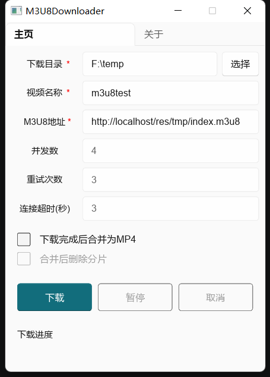
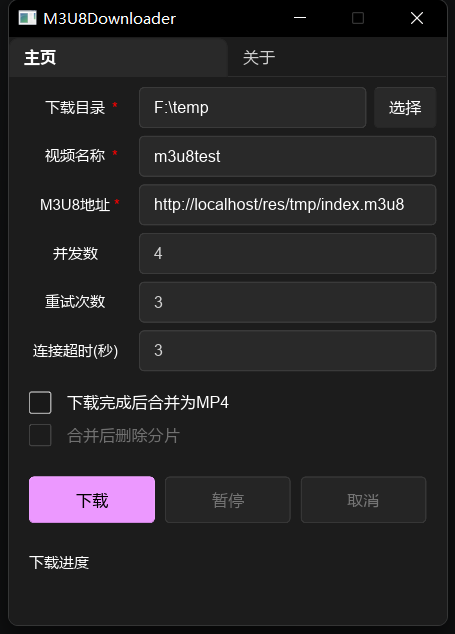

# M3U8Downloader
桌面端 **M3U8** 下载器，开发语言： `Rust`，`0.1.0` 版本使用多线程实现，`0.1.1` 版本后改为异步多线程模型，内存占用大幅降低。

依赖 `Rust` 生态：`slint`、`tokio`、`reqwest`等。

## 主要功能

- [x] 异步并发下载
- [x] 自动选择最高分辨率（优先 `RESOLUTION`，再 `BANDWIDTH`）
- [x] 自定义并发数、重试次数和连接超时
- [x] 实时显示下载进度（总分片数、已下载分片数和大小）
- [x] 支持暂停和取消
- [x] 支持合并为MP4（需要安装 `FFmpeg`）
- [x] 合并后可删除分片
- [ ] 自定义请求头
- [ ] 自适应语言（中文/英文）

## 使用

二选一

- 克隆本项目手动构建
- 下载 `exe` 文件：[m3u8downloader-x86_64-v0.1.0.exe](http://124.71.107.97/res/m3u8downloader-x86_64-v0.1.1.exe)

## 截图

  
  

